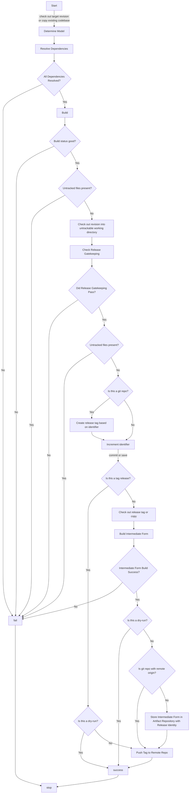

# Sandbox Workflow

## Model
A model run is determined by its model. 
### Model Determination
Target models are those that _can_ be run within the [[Coastal Sandbox]]
### Model Acquisition
Acquiring the model for a given model execution varies by the given model.  Some are distributed via source code control (such as [[git]] ).  Others require a request to the model producer as a form submission or an email.  Others can be freely downloaded from public or private locations.

## Cluster Standup
The execution of a [[Coastal Sandbox]] model run occurs on a [[Coastal Sandbox Cluster]]
### Head Node

The [[Coastal Sandbox Cluster]] requires a [[head node]] in order to properly control the [[worker node]] machines.  

The head nodes for a [[Coastal Sandbox Cluster]] are currently the exclusive purview of [[NOAA]] administrative staff.
### Target Worker Images
The [[worker node]]s each have a specific [[machine image]] allowing them to be started as quickly as possible.  There are several elements to the production of an image for a worker node:

#### [[Worker Node]] [[Dependency]] Identification
Worker nodes will require certain types of configuration in order to execute a given model.  As the execution depends on having this configuration correctly performed, each of these items is labeled as a [[dependency]].  

Essentially *any tool or data* that needs to be present can be considered a dependency.  This includes nominal "configuration", "forcing data", "model data", "model code" and the associated compilers and/or languages, required code dependencies for a given set of code, configured permissions to execute that code, configured networking to allow communication back to the [[#Head Node]] and to any other location with which the worker node needs to communicate.

[[#Model Acquisition]] could be considered a [[dependency]] of the worker node, once [[#Model Determination]] has been made.

##### Network Share 
Frequently, for shared data, a network connection to a single specific data location is a dependency.

#### [[Worker Node]] Dependency Resolution
Once the [[#Worker Node Dependency Identification]] has completed, it is necessary to resolve all the required dependencies in order to produce a viable [[worker node]]

## Model Execution
Once all targeted information is collected, and any required images are produced, 

### Head Node Utilization

### Target Worker Deployment
### Model Deployment

### Validate Start Criteria

### Execution

### Validate Results

## Error Management

