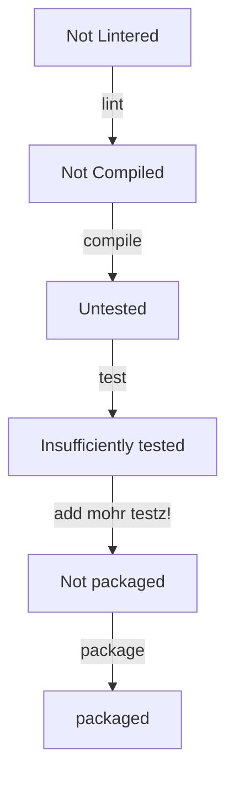
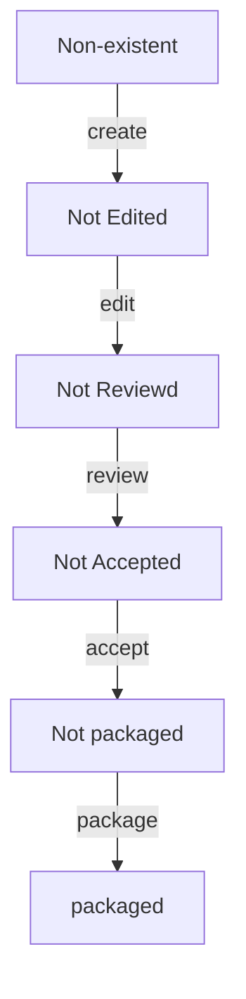

# Gatekeeping

<dl>
	<dt>Gatekeeping</dt>
	<dd>The task of ensuring that a given artifact is viable.</dd>
</dl>
	
Gatekeeping operations are the specific sub-states in the lifecycle of an artifact that must meet some criteria before proceeding to the next state.

Consider the following [[lifecycle]], subsequent additions or modifications to a list of general states (1-8) found in the [[lifecycle]]:

* In this case, one could say that for `lint` to be passed, the linter for the code could be executed with no changes required.  This is what "passed" might mean there, and thus the contents of the code could be eligible for compilation.  
* Once `compile` has passed, the code has been "compiled" (whatever that means).  
* Then `test`  might be run, but then a [[gatekeeping]] operation is required to see that they were sufficient to proceed.  
* If they were sufficient, then the process would move on to the `package` step to produce some potentially useful [[artifact]] that could move through some possible additional [[gatekeeping]].

If `lint`, `compile`, and `test` completed, but the subsequent gatekeeping operation did not, then this code would not make it past the state of being "insufficiently tested".  It _remains_ "insufficiently tested", and therefore is not eligible for `package` and thus cannot enter the "not packaged" state because it didn't pass the gatekeeping operation.  As a "not packaged" thing, it never reached its [[packaging#End State|end state]] and cannot be identified as an [[artifact]].

Now, consider a document written in Google Drive by someone.  It contains some content, so it has reached step 3.

- The text might have been speed-typed into the document.
- It would then need to pass `edit`, `review`, and `accept`
- It could then be assigned a [[version]] in the Google Document version history, completing the `package`.

Note that this [[lifecycle]] is not how non-engineers typically do their work.  It _IS_, however, a practical and prescribed method for  producing actually-useful documents.  Further, it does not require one to export copies and rename them with new dates to pass around in emails like savages.
