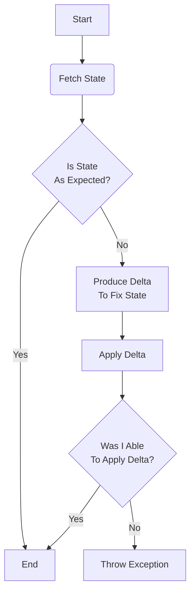

# Idempotency

## Definition
Idempotency within [[configuration management]] is an operational property that allows us to manage [[idempotence#Operational State|operational state]] safely.

Wikipedia has [a good definition](https://en.wikipedia.org/wiki/Idempotence).

For practical purposes, an idempotent operation can be repeated over and over again safely.  The practice generally has a flow that looks something like this:

As you can see, if the delta operation _needs_ to be accomplished, then work will be done.  If the delta operation _does not need_ to be done, because everything was in the expected state, then nothing will be done.

## Operational State
The operational state of an [[environment]] is the criteria under which that environment's [[platform]] is defined and then _decorated with the delta of the requirements that the environment actually exhibits_.  The operational state (_of an environment_) can be spoken of as a boolean.  It is either completely correct (`true`) or it is somehow not correct and therefore completely incorrect (`false`).  The delta between what makes a false state different from a true state would be the inverse of the changes needed to render the environment to the true state.

For a simple instance,  perhaps an environment is defined as an S3 bucket.  The bucket either exists or it does not , and thus it's operation state is either "present" (`true`) or "absent" (`false`).  In the face of no additional environmental requirements, this simplistic example is easy to denote.

For an _slightly_ more real instance, perhaps an environment is defined as an S3 bucket named `DisBucket` that can be read to from the `ReadDisBucket` role and written to by the `WriteDisBucket` role.  At the present time, the bucket can be read from, but cannot be written to.  This is because the operational state of that bucket has not completed or has drifted from the expected parameters.  In this case, the read role has been applied but the write role has not. Getting from `false` to `true` would be a matter of applying the write role to the environment.
