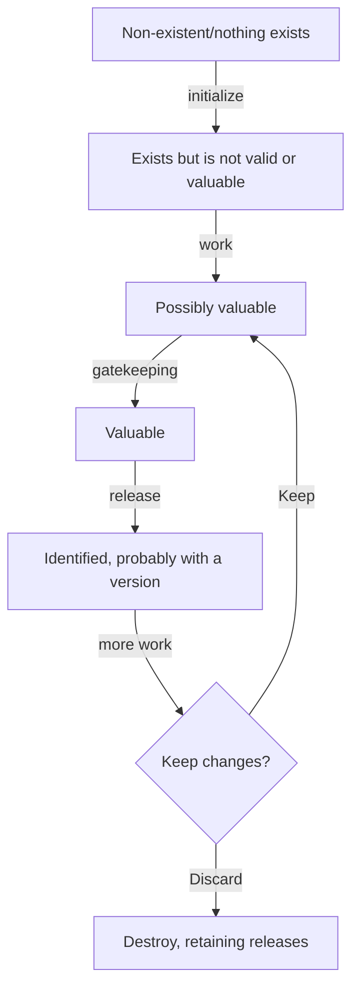

# Lifecycle

Everything that exists has a lifecycle, and builds are no different.\
Specific to this discussion, the lifecycle of many software [[artifact|artifacts]] look something like:

1. Non-existent.  Nothing to build exists.
2. Existent but not valid or valuable (e.g. an empty repository or document)
3. Existent and _possibly_ valuable (perhaps because it's being worked on, but the value is unknown at this time)
4. Valuable (some known set of [[gatekeeping]] criteria have been met)
5. [[version|Versioned]] with an identifier that signifies the value from step 4
6. Changed (after being versioned) and thus needing one of two things:
   1. Return to step 3, becoming _possibly_ valuable again OR
   2. Be determined to no longer have value, to be removed from validity and destroyed.

Any sort of [[artifact]] can and will transition through these states, and often many more-specific ones.

- A document will be created,  updated, edited, accepted, reviewed, and eventually have some indicator made of its state.
- A software repository will be able to be examined and found to be valuable and this have that state saved, perhaps through a [[release]].

## Outside the Lifecycle

It should be noted that what is generally considered a build does not _only_ have to be part of this lifecycle.  There might be additional intermittent tasks that are not directly relevant to the production of versions.   However, as they are not prescriptive in the [[lifecycle]], they are essentially considered one-offs.  Usually, these are ignored during the [[release]] process to produce an immutable [[artifact]].

An example of this is the "clean" lifecycle state.  This tends to exist in builds to provide the executing user with the ability to start from an untarnished and probably more well-defined state prior to beginning the lifecycle.
