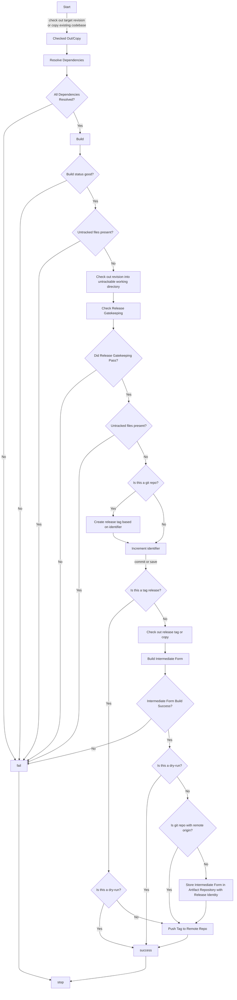

# Release

<dl>
<dt>release</dt>
<dd>(n.) an immutable version of an artifact produced by a build</dd>
<dd>(v.) to produce an immutable version of an artifact by successfully performing a process that includes a full build and the potential end artifact</dd>
</dl>

A release is the production of an immutable [[version]] of an [[artifact]].  Since this implies the existence of an artifact, it also implies that that artifact has passed whatever [[gatekeeping]] operations are present in the [[build]].

## Immutability

One of the key elements of a release is the concept of immutability, which is the state of not being capable of being changed.  

### Sameness
Once released, it is expected that the released artifact will remain _at least_ functionally identical across time and will _almost always_ remain binary identical.  
Any good [[artifact repository]] will prevent changes to stored [[intermediate form]] [[artifact|artifacts]].  However, entropy is a real thing in the universe we inhabit.  This means that sometimes artifacts are corrupted (bad storage media, perhaps) or perhaps inadvertently deleted (by a fat-fingered trusted agent) or even maliciously removed (by an intrusive agent).  When forced to choose between functional identity and binary identity, functional identity is the more reasonable choice.

### Agency

It should be noted that in almost every case, being immutable is a _choice_.  It is almost always the case that some set of people or processes has the agency to change the artifact.  It is nothing more or less than the fact that this set of people _decided that they would not do so_ that allows a nominal [[artifact]] to be defined as immutable.

Obviously, under that definition, how close to immutable something is revolves entirely around how much one trusts the responsible parties.

As a general rule, the number of people with such agency should be severely limited.  This allows for a reduced number of parties that require a trust relationship.

## Repeatability

As with any [[build#Repeatable|good build]], a good release process is repeatable.  [[#Immutability]] tends to make the process of repetition somewhat more complex.  The expectation is that that once a release is performed, it does not need to be performed again, nor should it be.  However, certain types of [[disaster recovery]] are predicated on a release having the innate capability to be performed again into a functionally identical state.

Good release practices will very often make a [[source code]] tag of the codebase at the time of release.  Indeed, [[tag release]]-style "releases" are generally nothing more than the creation of such a tag.  But for other types of releases, especially those that generate an [[intermediate form]], the expectation is that with some degree of preparation the release can be executed again by checking out the appropriate tag and running the process that generated the [[intermediate form]] originally.

This might mean deleting the tag once it has been checked out.  It might mean removing the existing artifact from some [[artifact repository]].  It might mean resetting a counter somewhere, or moving a target file into place.  All of these things are detrimental to the repeatability, but as previously stated, immutability makes most of this work unnecessary.

## Lifecycle

Good build engineering practice denotes that the best builds work within a strict [[lifecycle]].  Releases are, as a subscriber to the [[build]] process, also best worked within a lifecycle.

### Recommended Build Lifecycle

The following process describes the state of a release during a well-defined lifecycle performed with [[git]] as the source manager.

#### Check Out
Check out the target revision of the code.
#### Build
Perform a [[packaging]] operation to validate that the target artifact is generated.  

