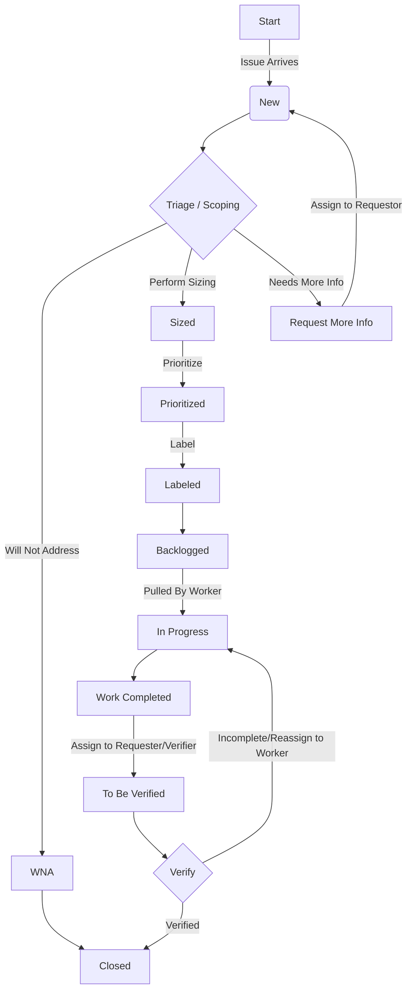
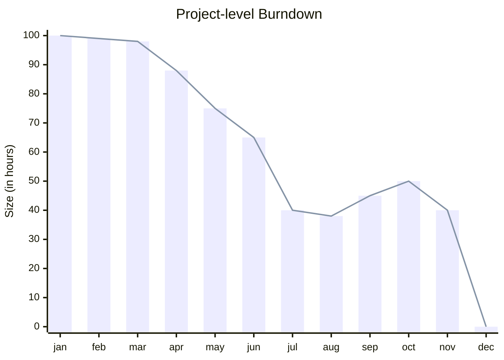

```mermaid
flowchart TD

    A[Start] -->|Issue Arrives| B(New)

    B --> C{Triage / Scoping}

    C -->|Will Not Address| D[WNA]

    D --> Z

    C -->|Perform Sizing| F[Sized]

    F --> |Prioritize| G[Prioritized]

    G --> |Label| H[Labeled]

    H --> BL[Backlogged]

    BL --> |Pulled By Worker| IP[In Progress]

    IP --> WC[Work Completed]

    WC --> |Assign to Requester/Verifier| TBV[To Be Verified]

    TBV --> V{Verify}

    V --> |Verified| Z

    V --> |Incomplete/Reassign to Worker| IP

    C -->|Needs More Info| E1[Request More Info]

    E1 --> |Assign to Requestor| B

    Z[Closed]
```

# Reporting

```mermaid
  

    xychart-beta

    title "Project-level Burndown"

    x-axis [jan, feb, mar, apr, may, jun, jul, aug, sep, oct, nov, dec]

    y-axis "Size (in hours)" 0 --> 100

    bar [100, 99, 98, 88,75,65, 40, 38, 45, 50, 40, 0]

    line [100, 99, 98, 88,75,65, 40, 38, 45, 50, 40, 0]
```